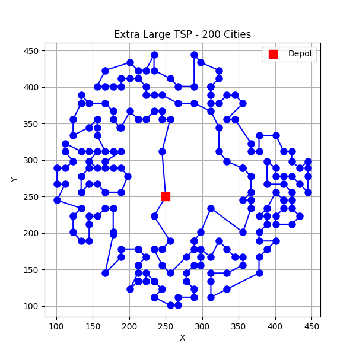

A **Rust** implementation of the Travelling Salesman Problem (TSP).

Run Rust engine:
```bash
cargo run data/case4.json result/res4.json
```

Run Python for visualization:
```bash
uv run main.py data/case4.json result/res4.json
```

See an example:
